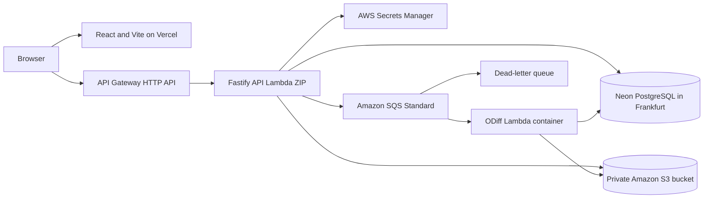

# Minimum viable product reference topology

Glint supports one production topology for its initial release. Provider-neutral interfaces remain
part of the code architecture, but staging and production do not carry multiple deployment recipes.

The client and API use separate subdomains. API Gateway terminates TLS, applies exact-origin CORS
and coarse throttling, records access logs, and invokes the stable API Lambda alias. Fastify owns
request validation, authentication, and tenant authorization.

## Production target

| Surface | Target |
| --- | --- |
| Region | AWS Frankfurt (`eu-central-1`) and Neon Frankfurt (`aws-eu-central-1`) |
| API | Fastify 5 ZIP on the managed Node.js 24 x86 Lambda runtime behind API Gateway HTTP API |
| Web | React and Vite static client on Vercel, deployed independently from the API |
| Database | Neon PostgreSQL 18, 0.25–2 compute units, scale-to-zero, pooled application endpoint, direct migration endpoint |
| Object storage | Private S3 Standard bucket with versioning, S3-managed encryption, and blocked public access |
| Queue | SQS Standard plus a dead-letter queue, one message per invocation, 90-second visibility |
| Worker | Node.js 24 x86 Lambda container, ODiff 4.3.8, 1,024 MiB memory, 512 MiB `/tmp` |
| Migrations | One-shot Node.js 24 ZIP artifact invoked before application alias promotion |
| Secrets | AWS Secrets Manager, loaded and cached per Lambda execution environment |
| Observability | Structured CloudWatch logs, metrics, alarms, and end-to-end correlation identifiers |
| Infrastructure | Terraform with OpenTofu compatibility in a separate private repository |

Lambda functions do not join a customer-managed VPC. They use secure public service endpoints for
Neon and GitHub and execution roles for AWS services. Production and staging both allow Neon and
Lambda to scale to zero. Health checks do not query the database.

## Local substitutes

| Production dependency | Local substitute | Contract invariant |
| --- | --- | --- |
| API Gateway and Lambda | Fastify listening directly on Node.js | Same routes, validation, authentication, and response mapping |
| Vercel | Vite development server | Same client entry and runtime API configuration |
| Neon | PostgreSQL 18 container | Same migrations, row-level security, transactions, sessions, and outbox tests |
| Amazon S3 | MinIO container | Same immutable keys and signed POST/read contract |
| Amazon SQS | In-process durable fake | Same job identities, leases, attempts, acknowledgement, redelivery, and dead-letter behavior |
| Lambda worker | Lambda image through the Runtime Interface Emulator | Same Node.js and ODiff versions, handler, limits, and corpus |

Local development requires no cloud credentials. Application packages own provider-adapter
contract tests. The infrastructure repository owns staging smoke checks for deployed permissions,
CORS, and service configuration.

## Safety limits

| Limit | Value | Enforcement point |
| --- | ---: | --- |
| Encoded PNG | 8 MiB | Signed POST policy and worker before decode |
| Decoded pixels | 16,777,216 | Worker before ODiff |
| Width | 4,096 pixels | Worker before ODiff |
| Height | 16,384 pixels | Worker before ODiff |
| Generated diff artifact | 8 MiB | Worker before object upload |
| Screenshots per shard/build | 2,000 / 10,000 | API application service |
| Shards per build | 64 | API application service |
| Screenshot name | 512 UTF-8 bytes | API validation |
| Per-screenshot metadata | 32 KiB | API validation |
| API request and response | 4 MiB | API Gateway integration and Fastify body handling |
| Upload lease | 30 minutes | Asset and build coordinator |
| ODiff/handler/Lambda deadline | 5 / 10 / 15 seconds | Child controller and Lambda handler |
| API application/Lambda deadline | 10 / 15 seconds | Fastify request controller and Lambda |
| Database statement deadline | 5 seconds | PostgreSQL client configuration |
| Worker memory/working set | 1,024 MiB / 64 MiB | Lambda and application byte accounting |
| API concurrency | 32 | Lambda reserved concurrency |
| Worker concurrency | 32 regional, 16 per account, 16 per installation | Lambda, SQS event source, and database leases |
| API traffic | 100 requests/second, burst 200 | API Gateway stage throttle |
| Sensitive API traffic | 10 requests/second, burst 20 | API Gateway route throttle |
| Queue age | warning at 60 seconds, critical at 300 seconds | CloudWatch alarms |
| Modeled burst | 143 jobs drained within 60 seconds | Staging benchmark |

Increasing a safety limit requires new measurements; it is not an environment-only change. As
implementation packages are added, each limit belongs beside the code that enforces it and its
tests rather than in a duplicate configuration manifest.

## Authentication and browser boundary

- GitHub OAuth creates an opaque, revocable PostgreSQL session.
- The browser receives only a random token in a secure, HTTP-only, API-host-only cookie.
- Credentialed CORS allows only the exact production and staging client origins.
- Cookie-authenticated mutations require an approved origin, JSON content type, and a preflight
  header.
- Continuous integration uses hashed project bearer tokens.
- GitHub webhooks use signature and delivery-identifier verification.
- Browser sessions, project tokens, and webhook credentials are never interchangeable.

## Release and rollback order

A versioned GitHub Release publishes attested API and migration ZIPs plus the public
`ghcr.io/shipfoxhq/glint-worker` image digest. Vercel builds the same source commit as a staged
production deployment without assigning the production domain. The application workflow opens a
release-manifest pull request for staging in the private infrastructure repository.

After review and merge, the infrastructure workflow:

1. verifies the release attestations and checksums;
2. copies the ZIPs to immutable, versioned objects in the deployment S3 bucket;
3. mirrors the worker image into private Frankfurt ECR and records its destination digest;
4. updates and invokes the migration artifact through the direct Neon endpoint;
5. publishes immutable API and worker Lambda versions;
6. moves stable staging aliases;
7. runs storage configuration, worker corpus, and API smoke checks;
8. promotes the exact staged Vercel deployment; and
9. records the deployed artifacts and versions.

Production uses a second reviewed manifest pull request that copies the exact staging source
commit, ZIP checksums, worker digest, and Vercel deployment. Promotion performs no rebuild.

API Gateway and the queue event source always reference aliases. A rollback reverts the release
manifest, moves aliases to previous immutable versions, and restores the previous Vercel
deployment. Database migrations use expand-and-contract changes and are never reversed
automatically.

## Retention and recovery

Current baselines and the latest open-pull-request builds remain available while active. Historical
image artifacts remain for 30 days, lightweight audit metadata for 90 days, and unreferenced objects
receive a seven-day deletion grace period.

The MVP is single-region. Neon provides at least seven days of point-in-time restore history, S3
keeps deleted or non-current versions for seven days, and PostgreSQL job state reconstructs queue
work. A database-and-object restore exercise is required before production. Cross-region failover is
not part of the initial topology.

No product workflow or customer traffic is enabled by this document. Provisioning and the first
staging deployment remain separate implementation work in the infrastructure repository.
