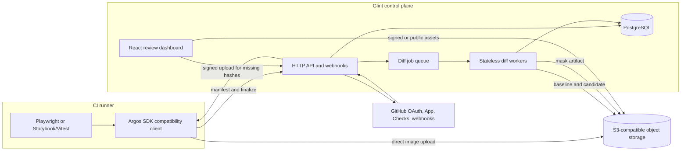
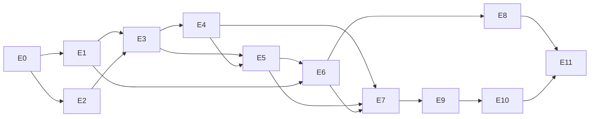

# Design: Glint visual regression platform

Generated by `/office-hours` on 2026-07-11
Branch: `noe-charmet/design-this`
Repo: `ShipfoxHQ/glint`
Status: APPROVED
Mode: Startup (internal infrastructure, open-source distribution)
Linear plan: https://linear.app/shipfox/document/glint-system-design-and-epic-plan-5ab6372620ef

## Linear execution index

| Epic | Linear project | Depends on |
| --- | --- | --- |
| E0 | [Repository and architecture foundation](https://linear.app/shipfox/project/glint-e0-repository-and-architecture-foundation-cc7240985df9) | None |
| E1 | [GitHub identity, tenancy, and project onboarding](https://linear.app/shipfox/project/glint-e1-github-identity-tenancy-and-project-onboarding-b9755db626a1) | E0 |
| E2 | [Content-addressed object storage](https://linear.app/shipfox/project/glint-e2-content-addressed-object-storage-0b506e2eca9c) | E0 |
| E3 | [Argos-compatible ingestion and build assembly](https://linear.app/shipfox/project/glint-e3-argos-compatible-ingestion-and-build-assembly-1a242bb0c4ac) | E1, E2 |
| E4 | [Baseline and comparison planning](https://linear.app/shipfox/project/glint-e4-baseline-and-comparison-planning-9babddac3556) | E3 |
| E5 | [Diff engine and asynchronous workers](https://linear.app/shipfox/project/glint-e5-diff-engine-and-asynchronous-workers-f24919e0c5fe) | E3, E4 |
| E6 | [Review dashboard using `@shipfox/react-ui`](https://linear.app/shipfox/project/glint-e6-review-dashboard-using-shipfoxreact-ui-952d9087063b) | E1, E5 |
| E7 | [GitHub Checks and pull-request lifecycle](https://linear.app/shipfox/project/glint-e7-github-checks-and-pull-request-lifecycle-053580f4c5a0) | E4, E5, E6 |
| E8 | [Public/native read API](https://linear.app/shipfox/project/glint-e8-publicnative-read-api-54ddd72afb00) | E6 |
| E9 | [Lifecycle, cost controls, and operations](https://linear.app/shipfox/project/glint-e9-lifecycle-cost-controls-and-operations-5b50454805f0) | E7 |
| E10 | [Shipfox cutover](https://linear.app/shipfox/project/glint-e10-shipfox-cutover-2c4f12a75fea) | E9 |
| E11 | [Open-source release polish](https://linear.app/shipfox/project/glint-e11-open-source-release-polish-e94e3f7566c0) | E8, E10 |

## Executive decision

Build Glint as a lean, multi-tenant visual regression control plane with:

- Argos-compatible ingestion for the existing Shipfox Playwright and Storybook/Vitest producers;
- content-addressed, tenant-scoped object storage;
- server-authoritative, asynchronous image comparison;
- a React review dashboard using the published `@shipfox/react-ui` package;
- GitHub OAuth for people and a GitHub App for repository events and Checks;
- a current-target-branch baseline model optimized for repositories that rerun the complete visual suite after merge;
- a modular pnpm/Turbo monorepo modeled on Shipfox's thin apps, feature packages, sibling DTO contracts, client packages, and enforced dependency layers;
- portable infrastructure boundaries around PostgreSQL, S3-compatible storage, a job queue, and diff workers.

Glint does not render pages or run browsers in the MVP. It receives artifacts produced by tests.

## Problem statement

Shipfox uses Argos for screenshots captured by Playwright E2E suites and Storybook/Vitest browser tests. AI-assisted development has increased pull-request volume by roughly 10–100x. Argos' per-screenshot pricing now projects to roughly `$1,000/developer/month`, making the current workflow economically incompatible with the new development rate.

The problem is not a missing visual-testing workflow. The problem is that the incumbent prices each screenshot as a billable event, while most repeated screenshots are identical content and require almost no new storage or comparison work.

## Demand evidence

- The existing visual regression workflow is already in daily use in Shipfox.
- The usage increase is observable in pull-request and screenshot volume, not hypothetical interest.
- At approximately `$1,000/developer/month`, cancellation of the hosted Argos subscription is sufficient value. Glint does not need direct revenue.
- The strict MVP is exactly the set of capabilities required to replace Argos for Shipfox.

## Status quo

Current producers:

1. Playwright client E2E suites call `stableScreenshot`/`argosScreenshot`. The shared Playwright config installs `@argos-ci/playwright/reporter`, identifies a surface with `buildName`, and uploads in CI.
2. `@shipfox/react-ui` stories run in Vitest browser mode. `@argos-ci/storybook/vitest-plugin` captures and uploads Storybook states under the `react-ui` build name.
3. Argos selects a baseline, computes image differences, hosts the review UI, and reports a GitHub status/check.

Glint must preserve the producer ergonomics. Initial migration should require only `ARGOS_API_BASE_URL`, a Glint project token, and GitHub App installation changes.

## Target user and narrowest wedge

Primary user: a Shipfox engineer or reviewer working on a pull request with visual changes.

Narrowest complete workflow:

1. Existing tests capture screenshots.
2. Glint receives the build and missing image objects.
3. Glint compares the build to the latest accepted target-branch baseline.
4. A GitHub Check links to the review dashboard.
5. An authorized reviewer approves or requests changes for the build.
6. The complete suite reruns after merge; a successful default-branch build becomes the next baseline.

## Constraints

- Multi-tenant from the first schema and authorization path.
- GitHub first; GitLab must fit behind a provider boundary later.
- Low fixed operating cost and no per-screenshot business metric.
- Cloud/serverless-friendly, but not coupled to a single cloud in core code.
- Public read APIs and public projects are supported; private is the default.
- Existing Argos SDK producers must work before a native Glint SDK exists.
- Repository structure follows the Shipfox modular-monorepo model: composition roots in `apps/`, domain and client packages in `libs/`, public contracts in sibling `*-dto` packages, package-owned migrations, and machine-enforced dependency direction.
- The dashboard uses `@shipfox/react-ui`; Glint does not create a parallel design system.
- The server, not an untrusted CI client, decides comparison results and GitHub conclusions.

## Non-goals for MVP

- Hosted browsers or remote Storybook rendering.
- GitLab integration.
- Billing, plans, screenshot quotas, or payment processing.
- Per-screenshot comments, collaborative threads, requested reviewers, or Slack notifications.
- Playwright trace hosting.
- Flaky-diff learning, automatic ignores, or AI review.
- Arbitrary branch-history reconstruction when a repository does not rerun on merge.
- A native Glint capture SDK. Argos-compatible ingestion is the migration path.
- Cross-tenant physical deduplication.
- Merge queues and branch-history recovery for repositories that skip the post-merge visual run.

## Premises

1. Capturing screenshots remains the responsibility of the test process.
2. Content deduplication and visual comparison are separate. Equal hashes skip upload and diff compute; unequal hashes produce a visual diff artifact.
3. Shipfox's complete post-merge run is the authoritative source for the target-branch baseline.
4. Approval gates the pull request but does not mutate the baseline directly.
5. Public visibility is an explicit project setting. Writes always require scoped authentication.
6. GitHub OAuth authenticates people; a GitHub App owns repository events and Checks.
7. We will reuse open Argos producer contracts, not the operationally broad Argos platform.

## Approaches considered

### Approach A: Self-host Argos

Fastest initial replacement, but inherits a large platform surface, PostgreSQL, Redis, RabbitMQ, DynamoDB, background workers, and ongoing upstream-fork work. It does not create a distinct open-source project or a low-operations reference architecture.

### Approach B: Lean Glint with Argos-compatible ingestion

Chosen. Implement only the Argos API v2 subset exercised by existing Shipfox SDKs, then own the smaller build, baseline, diff, review, and GitHub model.

### Approach C: Compute diffs inside CI

Potential later execution backend for trusted installations. It minimizes hosted compute but moves trust, platform binaries, baseline downloads, and failure diagnosis into every CI environment.

## Repository architecture

Glint uses the same modular-monorepo principles as `/Users/noe.charmet/code/platform`, adapted to a smaller product. The goal is not to reproduce Shipfox's package count. The goal is to preserve its ownership rules: apps compose, feature packages own behavior and persistence, DTO packages own wire contracts, client packages own UI workflows, and dependency direction is executable policy.

### Top-level layout

```text
glint/
  apps/
    api/                         HTTP API, OAuth callbacks, GitHub webhooks
    web/                         React dashboard composition root
    worker/                      Verification, diff, outbox, and GC job runtime
    migrate/                     One-shot ordered module migration runner

  libs/
    api/
      common-dto/                Shared cursor/error/identity wire schemas only
      accounts/                  Users, accounts, memberships, sessions
      accounts-dto/
      projects/                  Installations, repositories, projects, upload tokens
      projects-dto/
      assets/                    Content-addressed asset registry and verification lifecycle
      assets-dto/                Asset events and shared contract types
      builds/                    Upload assembly, manifests, baselines, reviews, Checks state
      builds-dto/                Native build/review API and build lifecycle events
      diffs/                     Comparison planning consumers, ODiff execution, mask/regions
      diffs-dto/                 Diff request/result event contracts
      compat/
        argos/                   Argos v2 route adapter and wire-to-core mapping
        argos-dto/               Recorded compatibility schemas/OpenAPI fixtures
      vcs/
        core/                    Provider-neutral repository/PR/branch/Check interfaces
        core-dto/                Provider event names and payload contracts
        github/                  GitHub OAuth/App/webhook/Checks implementation

    client/
      api/                       JSON transport, auth refresh, ApiError handling
      app-shell/                 Account/project navigation and global layout
      auth/                      Login/session/account selection UI
      projects/                  Project onboarding, installation, settings, tokens
      builds/                    Build list, comparison canvas, review workflow
      router/                    Route tree and typed route context

    shared/
      node/
        config/                  Environment schemas and startup validation
        database/                PostgreSQL connection, RLS tenant context, migrations
        module/                  Declarative GlintModule composition contract
        object-store/            BlobStore interface plus selected S3-compatible adapter
        outbox/                  Transactional outbox primitives and dispatcher
        queue/                   JobQueue interface plus selected production adapter
        observability/           Logging, metrics, tracing, correlation IDs

  e2e/
    core/                        Environment, API clients, polling, Playwright re-export
    kit/                         Shared fixtures and screenshot-review authoring helpers
    setup/                       Module-owned HTTP setup clients
    screens/
      review/                    Dashboard page objects, type-only against Playwright
    suites/
      api/
        compat-argos/            Real pinned Argos producer contract tests
        platform/                Native API/auth/tenancy/build contract tests
      client/
        dashboard/               Browser review and onboarding behavior
      flow/
        github/                  Upload → diff → review → Check → merge baseline loop

  tools/                         Empty initially; only Glint-specific tooling may live here
  docs/                          Architecture, ADRs, deployment, security, contribution docs
  package.json
  pnpm-workspace.yaml
  turbo.jsonc
  biome.json
  .dependency-cruiser.cjs
  mise.toml
```

The layout is an intended end-state map, not a requirement to scaffold empty packages. E0 creates a package when its first owned behavior lands. Empty future packages are not committed.

### Apps are composition roots

Apps own runtime wiring and deployment entrypoints, not domain behavior:

- `apps/api` constructs concrete database, blob, queue, and GitHub adapters; composes module routes/auth/subscribers; and starts the stateless HTTP runtime.
- `apps/worker` composes the same module declarations but starts only job handlers, outbox dispatchers, verification/diff consumers, and scheduled maintenance.
- `apps/migrate` collects module-owned migration directories in dependency order and runs them once during deployment. Serverless request startup never races migrations.
- `apps/web` composes router/app-shell/client features and imports `@shipfox/react-ui/index.css` once. Routes render feature exports rather than owning feature state or API calls.

No app imports `#core`, `#db`, `#presentation`, or another package's source path. It consumes intentional package-root exports and injects concrete providers into module factories.

### Declarative backend modules

Each backend feature package exports one small `GlintModule` declaration, following Shipfox's `ShipfoxModule` composition pattern:

```ts
interface GlintModule {
  name: string;
  database?: {migrationsPath: string};
  routes?: RouteDefinition[];
  auth?: AuthMethod[];
  publishers?: OutboxPublisher[];
  subscribers?: EventSubscriber[];
  jobs?: JobHandler[];
  metrics?: () => void;
}
```

The exact types are decided in E0. The invariant is stable: feature packages declare capabilities, while apps decide which capabilities run in an API, worker, or migration process. Module initialization order is explicit and validated against declared dependencies.

Feature package internals use a consistent layered shape:

```text
libs/api/<feature>/
  drizzle/                       Feature-owned migrations, including RLS policies
  src/
    core/                        Domain entities, policies, ports, typed errors
    db/                          Drizzle schema, repositories, row-to-domain mappers
    presentation/                Routes, auth adapters, wire/core DTO mappers
    subscribers/                 Cross-module event handlers
    jobs/                        Queue handlers and scheduled maintenance
    metrics/                     Feature metrics registration
    index.ts                     Deliberately small public/module surface
  package.json
```

Not every package needs every directory. `compat/argos` is primarily presentation and mapping. `diffs` is primarily core/jobs. Empty layers are omitted.

### Domain ownership

| Package | Owns | Does not own |
| --- | --- | --- |
| `api-accounts` | Users, accounts, memberships, sessions, roles | GitHub installations or projects |
| `api-projects` | VCS installation links, repositories, projects, compatibility tokens | Builds, blobs, comparisons |
| `api-assets` | Asset rows, tenant hashes, upload/verification leases, retention refs | Build manifests or diff policy |
| `api-builds` | Build/shard assembly, snapshot identities, baseline pointers, reviews, logical Check state | Blob I/O or pixel algorithms |
| `api-diffs` | Diff jobs, engine config/version, comparison artifacts, masks, regions | Baseline selection or review policy |
| `api-compat-argos` | Exact `/v2` wire compatibility and conversion | Core build policy |
| `api-vcs-core` | Provider ports and provider-neutral repository/PR/branch/Check model | GitHub SDK calls |
| `api-vcs-github` | OAuth/App tokens, signature verification, GitHub API/webhook mapping | Core baseline/review decisions |

Cross-feature orchestration uses injected public service ports for synchronous reads/actions and typed outbox events for asynchronous work. A feature never reaches into another feature's Drizzle schema or `db/` helpers. State change and its outbox event commit in the same module-owned transaction.

Examples:

- `api-builds` emits a typed diff-request event; `api-diffs` consumes it and emits a typed result event; `api-builds` applies the result through its public core service.
- `api-vcs-github` emits provider-neutral pull-request/push events; `api-builds` consumes them to freeze reviews and maintain branch observations.
- `api-compat-argos` calls the public build/asset application services and maps the result into the recorded Argos response shape; it cannot query build tables directly.

### DTO and event-contract packages

Each public HTTP/event surface has a sibling `*-dto` package. DTO packages contain Zod schemas, inferred types, and event name/payload maps only.

Rules:

- DTO production dependencies may include other `*-dto` packages and pure third-party schema libraries, never server/client/database packages.
- External HTTP JSON uses `snake_case`; internal domain objects use `camelCase`.
- `presentation/dto/*` owns wire/domain conversion. Route handlers do not shape large response objects inline.
- Compatibility DTOs preserve the recorded Argos casing and quirks exactly; they are not reused as Glint's native API model.
- Outbox event contracts live in the owning module's DTO package and are versioned independently from database rows.
- Clients and E2E helpers consume DTO packages, never backend implementation packages.

### Client feature packages

The web app follows Shipfox's feature-package model:

- raw request functions, React Query keys/hooks, and mutation hooks live together under the owning client feature;
- forms consume the corresponding DTO Zod body schemas;
- labeled inputs use `@shipfox/react-ui/form-field` and other UI primitives through subpath imports;
- the image comparison canvas remains in `client-builds` until a second consumer proves it deserves a shared React package;
- `apps/web` owns only top-level providers, route composition, CSS entry, and runtime configuration.

Client packages may depend on DTOs, `client-api`, other intentional client public surfaces, and `@shipfox/react-ui`. They never depend on `libs/api/*` implementation packages or Node-only shared packages.

### Shared packages and tooling reuse

Glint reuses the public Shipfox toolchain where it is product-agnostic:

- `@shipfox/biome`;
- `@shipfox/swc`;
- `@shipfox/typescript`;
- `@shipfox/ts-config`;
- `@shipfox/vite`;
- `@shipfox/vitest`;
- `@shipfox/depcruise`;
- `@shipfox/react-ui`;
- public Node helpers such as `@shipfox/node-fastify` or `@shipfox/node-postgres` only after E0 confirms they are suitable and independently published.

Shipfox-private packages such as `@shipfox/node-module`, database, or outbox internals cannot be dependencies of an open-source Glint checkout. Glint implements the small equivalents it needs under `libs/shared/node/*`, with their behavior covered locally.

`tools/` stays empty unless Glint develops genuinely Glint-specific build tooling. It must not fork public Shipfox wrappers merely to change a name.

### Package exports

- Every package uses `#* -> ./src/*` for its own explicit internal imports.
- Avoid broad internal barrels. Import the file that owns the symbol.
- Package-root exports are intentionally small: module factory, public service interface, public domain types/errors needed by another package.
- DB helpers, route implementations, auth wiring, concrete job functions, and test utilities are not root exports unless another package is explicitly designed to consume them.
- Development/default export conditions point at `src` and `dist` respectively, matching Shipfox workspace ergonomics.
- Workspace dependencies use `workspace:*`; every package declares the packages it verifies or imports so Turbo sees the real DAG.

### Enforced dependency direction

```mermaid
flowchart TD
  Apps[apps: api, worker, migrate, web]
  Client[libs/client feature packages]
  Api[libs/api feature modules]
  Compat[api/compat adapters]
  Providers[api/vcs concrete providers]
  ProviderCore[api/vcs/core]
  DTO[all *-dto contract packages]
  SharedNode[libs/shared/node primitives]
  ReactUI[@shipfox/react-ui]

  Apps --> Client
  Apps --> Api
  Apps --> Compat
  Apps --> Providers
  Client --> DTO
  Client --> ReactUI
  Compat --> Api
  Compat --> DTO
  Api --> DTO
  Api --> ProviderCore
  Api --> SharedNode
  Providers --> ProviderCore
  Providers --> DTO
```

Forbidden edges enforced by Dependency Cruiser:

1. DTO → non-DTO workspace package.
2. Client → backend implementation or Node package.
3. Backend `core/` → its own `db/`, `presentation/`, `jobs/`, or concrete providers.
4. One feature → another feature's `db/`, `presentation/`, or source path.
5. Shared package → feature package.
6. VCS core → GitHub implementation.
7. Compatibility adapter → database internals.
8. App → deep package internals.
9. Browser package → Node built-ins.
10. E2E suite → another suite, and E2E code → backend packages instead of DTO/public setup helpers.

Package-local `depcruise` runs through Turbo alongside `check`, `type`, `type:emit`, `build`, and `test`. Root CI also checks the workspace graph for cycles.

### Workspace and task conventions

- pnpm with `nodeLinker: isolated`, strict peer dependencies, and lockfile supply-chain settings aligned with Shipfox.
- Turbo task names and semantics mirror Shipfox: `build`, `check`, `type`, `type:emit`, `test`, `test:e2e`, `depcruise`, `dev`, and `image` where applicable.
- `mise.toml` pins Node/pnpm and exposes contributor commands; package scripts remain independently runnable.
- Migrations, unit tests, and config belong to the package that owns the behavior.
- Each package that reads environment variables owns a flat `src/config.ts` schema with startup validation and self-hoster-facing descriptions.
- Changesets are introduced only when Glint publishes native SDK/package artifacts; internal workspace packages remain private.

## System architecture



### Architectural boundaries

| Boundary | Responsibility | Must not own |
| --- | --- | --- |
| Web | Dashboard routes, review interaction, project settings | Baseline selection or diff conclusions |
| API | Auth, tenancy, compatibility/native APIs, signed URLs, webhooks | Image decoding or long-running comparison |
| Core | Build state machine, baseline policy, review policy, provider-neutral contracts | SQL, R2, GitHub SDK calls |
| Database | Durable metadata, constraints, transactions, outbox | Image bytes |
| Object store | Immutable source images and diff masks | Authorization decisions or baseline pointers |
| Queue | At-least-once job delivery | Source of truth for job state |
| Diff worker | Verify inputs, compare pixels, produce masks/regions | User auth, baseline selection, GitHub updates |
| GitHub adapter | OAuth, App tokens, webhooks, Checks | Core build-policy decisions |

Core interfaces should include `BlobStore`, `JobQueue`, `DiffEngine`, and `VcsProvider`. They permit S3/R2/MinIO, SQS/Cloudflare Queues/local adapters, ODiff/Pixelmatch, and GitHub/GitLab without leaking provider concepts into build logic.

## Ingestion protocol

The Argos JavaScript core already discovers files, optimizes screenshots, computes hashes, chunks metadata, supports parallel shards, and uploads directly through signed object-store forms. Glint should implement the smallest compatible API surface instead of forking the producer immediately.

### Compatibility gate before platform implementation

Endpoint/token-only migration is an assumption until exercised against the exact Shipfox dependency set. The first E0 deliverable is a throwaway compatibility recorder, not reusable platform code. It runs the current producers against a recording server and publishes sanitized, versioned request/response fixtures and a minimal OpenAPI contract.

Initial pinned Shipfox lockfile versions are:

- `@argos-ci/playwright@7.0.6`;
- `@argos-ci/storybook@6.0.7`;
- `@argos-ci/cli@5.0.5`.

The spike must capture:

- every HTTP method, path, auth header, request body, response body, and error shape;
- the signed multipart POST shape (`key`, `postUrl`, returned form fields, file field, content type);
- no-baseline, unchanged, changed, zero-screenshot, skipped, metadata-chunked, parallel-shard, manual-finalize, retry, and upload-failure flows;
- which SDK response fields are required rather than merely present;
- compatibility behavior against the actual S3-compatible provider selected for staging.

Legacy `ARGOS_TOKEN` validation requires exactly 40 characters. Glint compatibility project tokens therefore use a 40-character high-entropy representation and `Authorization: Bearer <token>` until a native Glint SDK removes this constraint. OIDC/tokenless Argos auth endpoints are not part of the initial cutover; Shipfox sets `ARGOS_TOKEN` explicitly.

E3 cannot begin until these fixtures pass against both the recorder and the proposed Glint contract. If undocumented behavior makes the subset impractical, the decision returns to a small SDK fork rather than expanding Glint to emulate all of Argos.

Initial compatibility endpoints:

| Endpoint | Purpose |
| --- | --- |
| `GET /v2/project` | Resolve project settings and default branch |
| `POST /v2/baseline` | Return a compatible baseline commit when requested by the SDK |
| `POST /v2/builds` | Idempotently create/join a build and return signed uploads only for missing hashes |
| `PUT /v2/builds/{buildId}` | Append screenshot metadata chunks and finalize a shard |
| `POST /v2/builds/finalize` | Finalize manually coordinated parallel builds |
| exact skipped-build endpoint captured in E0 | Preserve required-check behavior for conditionally skipped CI jobs |

The compatibility surface is contract-tested against pinned versions of:

- `@argos-ci/core` / CLI upload;
- `@argos-ci/playwright/reporter`;
- `@argos-ci/storybook` Vitest plugin.

The OpenAPI schema is versioned. CI pins known-compatible SDK versions. Unsupported fields are accepted when safe and ignored explicitly, not allowed to mutate internal state accidentally.

### Full-build and subset semantics

- `subset: false` or omitted declares that the finalized union of all shards is the complete manifest for this `project/buildName/commit`. Snapshot identities missing from the baseline are `removed`.
- `subset: true` declares an intentionally incomplete manifest. Missing baseline identities are ignored, the build cannot remove snapshots, and it is never eligible to replace a branch baseline.
- Parallel shards are assembled before comparison planning. Individual shards are partitions, not subsets. If any shard declares `subset: true`, the assembled build is treated as a subset.
- An empty full build is valid and marks every prior baseline snapshot for that build name as removed. On the default branch it may promote an empty baseline only under the same eligibility policy as any other full build.
- An empty subset build is valid, produces no removals, cannot promote, and concludes unchanged/skipped according to the captured compatibility contract.
- An omitted build name means no build exists and has no effect on that build name's baseline.
- A missing or invalid shard prevents manifest completion. No removals, comparisons, or promotion are computed from a partial union.

### Upload sequence

```mermaid
sequenceDiagram
  participant SDK as CI SDK
  participant API as Glint API
  participant Blob as Object store
  participant DB as PostgreSQL
  participant Q as Job queue
  participant Worker as Verification/diff worker

  SDK->>SDK: optimize files and compute SHA-256 hashes
  SDK->>API: create build with hash/content-type manifest
  API->>DB: create or join idempotent build
  API-->>SDK: signed uploads for tenant-missing hashes only
  SDK->>Blob: upload missing immutable objects directly
  SDK->>API: append snapshot metadata and finalize shard
  API->>DB: close shard; move build to awaiting-assets
  API->>Q: enqueue verification for referenced non-ready hashes
  Q->>Worker: verify asset job
  Worker->>Blob: read bytes; verify SHA-256/decode/limits
  Worker->>DB: mark asset ready or quarantined
  API->>DB: coordinator observes all shards complete and all assets ready
  API->>DB: atomically freeze manifest and create comparison plan/outbox
  API->>Q: dispatch required diff jobs
```

### Idempotency and parallel builds

- A build identity is scoped by project, build name, commit, and parallel nonce/run identity.
- A shard identity is scoped by build and shard index.
- Metadata chunks carry stable request/shard keys and may be retried.
- Finalization is monotonic: a frozen build manifest cannot be mutated.
- A fixed-total build is complete only after all declared indexes finalize. Manual finalization applies only to `total: -1` and closes that nonce.
- Duplicate screenshot names within the same build name and variant are rejected with an actionable error.
- An empty complete build is valid and represents removal of all previous snapshots for that build name.
- A declared shard total is immutable. Conflicting totals, duplicate indexes with different manifests, indexes outside `1..total`, or manual finalization of a fixed-total build are rejected.
- Fixed-total builds finalize when every index is present. `total: -1` builds finalize only through the compatibility finalize endpoint, authenticated by the same project's upload/finalize scope and matching nonce.
- An upload lease starts with the first build/shard request and expires after a configurable interval established by the E0 traffic measurement. A reconciliation job marks incomplete builds `expired`, fails their Check with missing shard indexes, and releases upload leases.
- Explicitly superseded and expired builds reject new metadata. A fresh CI attempt receives a new run identity rather than reopening a frozen build.

## Content-addressed storage

Object keys are tenant-scoped, for example:

```text
accounts/{accountId}/source/sha256/{first2}/{hash}
accounts/{accountId}/diff/{engineVersion}/{configHash}/{baseHash}/{headHash}.png
```

Tenant-scoped keys avoid cross-tenant existence oracles, simplify deletion, and preserve isolation. Deduplication across builds and projects inside one account provides most of the economic value.

Rules:

- Source objects are immutable.
- The declared hash is verified before the asset becomes usable. A mismatch quarantines the upload and fails the build.
- Signed uploads are short-lived and constrain key, content type, and maximum size.
- The API never proxies normal upload bytes.
- Repeated source hashes create references, not objects.
- Repeated `(baseHash, headHash, engineVersion, configHash)` pairs reuse the comparison artifact and skip diff compute.

### Asset verification lifecycle

Assets have a monotonic lifecycle:

```text
declared -> upload-pending -> verifying -> ready
                              \-> quarantined
ready -> quarantined (later storage/decoder integrity failure)
ready/quarantined -> deletion-pending -> deleted
```

1. `POST /v2/builds` upserts one tenant/hash asset row. A ready asset returns no upload. A missing asset receives a short-lived upload lease and signed form. Concurrent declarations join the same row; only an expired/failed lease may be replaced.
2. The SDK uploads directly to the private bucket and finalizes metadata.
3. Finalization moves referenced non-ready assets to `verifying` and enqueues one idempotent verification job per tenant/hash. The build waits in ingestion verification; it cannot schedule pixel comparisons yet.
4. The verification worker reads the object, recomputes SHA-256 over the stored optimized bytes, decodes enough metadata to validate content type/dimensions/limits, and writes byte size/dimensions.
5. Matching objects become `ready`. A mismatch, corrupt encoding, or limit violation becomes `quarantined`; the object is denied to all builds, scheduled for deletion, and every waiting build receives the exact hash/error.
6. Transient reads retry with bounded backoff. Permanent verification failure makes the build invalid rather than leaving it pending.

Database uniqueness and a verification lease make concurrent upload/finalize calls safe. A quarantined hash is not silently reusable: a privileged cleanup or expiry must remove the bad object before a later upload may claim a new lease for the same declared hash.

Corruption has two distinct outcomes. Pre-ready verification failure makes ingestion invalid and schedules no comparisons. If a previously ready immutable object later cannot be read, hashed, or decoded, the worker marks the asset quarantined, errors only comparisons referencing it, lets independent comparisons finish for diagnostics, and concludes the build with `comparison: error`.

## Diff pipeline

### Engine contract

```ts
type DiffResult =
  | {status: 'unchanged'}
  | {
      status: 'changed';
      differentPixels: number;
      differenceRatio: number;
      width: number;
      height: number;
      mask: DiffMaskArtifact;
      regions: Array<{x: number; y: number; width: number; height: number}>;
    }
  | {status: 'layout-changed'; base: Dimensions; candidate: Dimensions; mask?: DiffMaskArtifact};
```

The MVP engine input includes threshold, anti-alias policy, and a pinned engine/config version. Additional comparison controls require a later contract version.

### Initial engine decision

Benchmark ODiff and Pixelmatch on a Shipfox fixture corpus before locking the runtime:

- identical images;
- one-pixel and subtle color changes;
- text anti-aliasing differences;
- transparent images;
- different dimensions;
- full-page screenshots up to the configured limit;
- noisy/non-deterministic fixtures already seen in CI.

ODiff is the expected production choice because it is SIMD-optimized and already proven by Argos. Pixelmatch is a benchmark alternative, not an oracle: its perceptual and anti-alias algorithms may legitimately produce different masks. Each engine uses reviewed engine-specific goldens. Cross-engine tests assert behavioral invariants such as exact equality passing, real structural changes being detected, deterministic output, and limits being enforced.

### Worker behavior

1. Claim comparison job idempotently.
2. Return immediately for equal hashes or an existing comparison artifact.
3. Download baseline and candidate to bounded ephemeral storage.
4. Verify content hash and image limits.
5. Normalize dimension handling without mutating source assets.
6. Run the pinned diff engine.
7. Store a transparent mask only when changed.
8. Derive connected changed regions for dashboard navigation.
9. Transactionally persist the artifact and comparison result.
10. Let the build aggregator conclude the build when no comparisons remain.

Workers accept at-least-once delivery. Every output key is deterministic, and database uniqueness makes retries safe.

### Limits and runtime gate

No decoded-pixel or worker-memory default is accepted from incumbent code without measurement. E0 benchmarks representative Shipfox long screenshots at observed peak concurrency on each candidate worker runtime, including native ODiff startup and corrupt/compression-bomb inputs, before selecting the production providers. The E0 runtime ADR sets provisional safety ceilings; E5's larger reviewed engine corpus may tighten them but does not reopen the provider choice unless a gate fails. The ADR sets:

- maximum encoded bytes and decoded pixels per image;
- maximum width/height and dimension-mismatch policy;
- maximum snapshots and metadata bytes per build/shard;
- worker memory, timeout, and ephemeral-disk limits;
- account and installation concurrency limits;
- scale-to-zero cold-start and queue-age targets.

Staging rejects inputs above those measured limits with an actionable error. The staging skeleton is deployed only after the selected runtime runs the pinned native ODiff binary and measured corpus within those ceilings.

## Baseline model

Baseline identity is `(projectId, buildName, targetBranch)` and points to one eligible full branch-build manifest. In Shipfox MVP, configured target branches are the default branch only; non-default protected target branches can be enabled later only when their complete suites also run after changes land.

Concrete terms:

- **Complete manifest:** ingestion is finalized; every fixed-total shard exists, or a `total: -1` nonce was closed by the authorized manual-finalize endpoint; the assembled build is not a subset; every referenced asset is ready; screenshot identities are unique; no verification/comparison error exists.
- **Branch observation:** a trusted push-webhook record `(repository, branch, epoch, generation, headSha)`. On webhook processing Glint fetches the current GitHub ref, ignores delayed deliveries that do not match it, increments generation, and starts a new epoch when GitHub reports the new head is not descended from the prior observed head (force-push/rewrite).
- **Promotion order:** baseline pointers store `(epoch, generation)`. A candidate may only replace a pointer with a strictly greater observed tuple; within a new force-push epoch, the first promoted build establishes the new lineage. Database compare-and-swap includes pointer version plus epoch/generation.
- **Approved-PR origin:** GitHub associates the branch commit with a merged PR targeting that branch, and Glint has an approved PR build for the same project/build name and frozen PR head. Squash/rebase merge association comes from GitHub provider data, not Git ancestry inference.
- **Promotion eligible:** a complete manifest produced for a commit that exactly matches a trusted branch observation and has a tuple strictly greater than the baseline pointer. Subset, skipped, expired, invalid, unobserved, or errored builds are ineligible.
- **Initial baseline:** a promotion-eligible branch build when no pointer exists. It requires owner review unless it has approved-PR origin.
- **No baseline PR build:** all submitted snapshots are `added`; an empty full build has no changes. Any added snapshots require normal PR review but cannot create the branch baseline.

### Pull-request build

1. Resolve the PR target branch from trusted GitHub data, not upload claims alone.
2. Read the current promoted baseline pointer for that branch/build name.
3. Freeze the baseline build ID and commit on the PR build so results remain reproducible.
4. Compare snapshot identities:
   - same name/variant and same hash → unchanged;
   - same identity and different hash → changed;
   - only candidate → added;
   - only baseline → removed, unless the build is explicitly a subset.
5. Unchanged builds pass automatically. Changed builds require review.

### Default-branch build

1. A complete, non-subset visual suite runs after merge.
2. Match the upload commit to its trusted branch observation and freeze epoch/generation on the build. An unobserved commit is rejected as a branch build.
3. If the commit has approved-PR origin, a complete verified manifest needs no second pixel comparison: it auto-promotes with `comparison: not-required` and `review: not-required`.
4. If origin is a direct push or cannot be proven, compare with the current baseline. An unchanged manifest may promote automatically; changed/no-baseline manifests require owner/reviewer approval before promotion.
5. Promotion transactionally compare-and-swaps pointer version and requires candidate `(epoch,generation)` greater than the stored tuple. A later webhook/build can advance it again; no completion can move it backward.
6. A build whose tuple is already at/below the pointer becomes `stale`. A full build from an earlier but still newer observed generation may promote even when more pushes have arrived, preventing starvation during sustained merge traffic; the eventual latest-generation run advances it again.
7. Push observation creates an expected latest-head build/check timer. If no complete build arrives within the operational SLA, alert and keep the prior baseline rather than guessing. Latest-generation branch jobs receive queue priority, but older valid jobs need not be cancelled.

Force-push behavior starts a new epoch; the prior baseline remains until a reviewed/approved-origin full build from an observed new-epoch head promotes. Squash/rebase merge history uses GitHub's merged-PR association plus the post-merge manifest. Merge queues are unsupported in MVP and must be rejected/documented rather than guessed.

Shipfox branch protection/no-direct-push rules are a hard cutover prerequisite and are verified in the cutover runbook. Safety does not depend on that configuration alone: any branch build not traceable to an approved PR follows the compare-and-review fallback above.

## Build and review state machines

One overloaded build status cannot represent ingestion, comparison, review, and promotion. Persist four orthogonal states:

| Dimension | States |
| --- | --- |
| Ingestion | `open`, `awaiting-assets`, `finalized`, `expired`, `invalid`, `superseded` |
| Comparison | `not-started`, `not-required`, `processing`, `no-baseline`, `unchanged`, `changes`, `error`, `skipped` |
| Review | `not-required`, `pending`, `approved`, `rejected` |
| Promotion | `not-applicable`, `ineligible`, `pending`, `promoted`, `stale`, `error` |

Key transition rules:

| Build kind/result | Comparison | Review | Promotion |
| --- | --- | --- | --- |
| Explicit compatible skipped build | `skipped` | `not-required` | `ineligible` |
| First branch build with approved-PR origin | `not-required` | `not-required` | `promoted` |
| First branch build without approved-PR origin | `no-baseline` | `pending` | `pending`, then `promoted` after approval |
| PR with no baseline and added screenshots | `no-baseline` | `pending` | `not-applicable` |
| PR unchanged | `unchanged` | `not-required` | `not-applicable` |
| PR changes/additions/removals | `changes` | `pending` | `not-applicable` |
| PR any permanent comparison error | `error` | `not-required` | `not-applicable` |
| Newer observed branch build with approved-PR origin | `not-required` | `not-required` | `promoted` |
| Newer observed direct/unknown-origin branch build, unchanged | `unchanged` | `not-required` | `promoted` |
| Newer observed direct/unknown-origin branch build, changed | `changes` | `pending` | `pending`, then `promoted` after approval |
| Observed branch build at/below pointer generation | result or `not-required` | `not-required` | `stale` |
| Any subset branch build | result as computed | `not-required` | `ineligible` |
| Expired/invalid ingestion | `not-started` | `not-required` | `ineligible` |

Review decisions are append-only audit events with one effective decision per immutable build version:

- A PR decision requires GitHub to report the PR open and the immutable build commit equal to its current head. A closed/merged PR and any non-current/superseded build reject new decisions.
- On `pull_request.closed`, Glint freezes the effective review event ID and decision for each current build name. The audit stream remains readable but immutable. Closing without merge cannot create approved-PR origin.
- Approved-PR origin requires the frozen decision to be `approved`. The branch-promotion transaction rechecks that frozen review ID/decision together with the branch epoch/generation and baseline-pointer version; a mutable/cancelled association cannot race promotion.
- A promotion-pending direct/unknown-origin branch build in `review: pending|approved|rejected` may accept a decision until it promotes, becomes stale, or is superseded.
- Reviewer/owner may replace `pending`, `approved`, or `rejected` with `approved` or `rejected`; the new audit event supersedes the prior effective event. Repeating the same idempotency key is a no-op.
- A new CI attempt creates a new immutable build version with its own `pending` decision. Prior approval never carries forward automatically.
- Superseded builds are read-only. Their review history remains audit data under retention policy.
- Check conclusion is derived from these dimensions, never stored as an independent source of truth.

## Data model

All tenant-owned tables include `account_id`. Relationships use account-scoped composite foreign keys. PostgreSQL row-level security is mandatory defense in depth for request-path roles: each transaction sets a validated tenant context, and policies constrain both reads and writes. Cross-tenant maintenance/GC uses a separate audited service role and never runs in a user request. If the selected serverless pooler cannot safely preserve transaction-local tenant context, the provider/runtime ADR must solve that before implementation rather than silently dropping RLS.

| Entity | Key fields and purpose |
| --- | --- |
| `users` | GitHub identity, profile metadata |
| `accounts` | Tenant slug, name, default visibility, limits |
| `memberships` | Account/user role: owner, reviewer, viewer |
| `vcs_installations` | Provider type, GitHub installation ID, encrypted/scoped metadata |
| `repositories` | Account, provider repository ID, owner/name, default branch, installation |
| `projects` | Repository link, slug, visibility, retention and baseline policy |
| `project_tokens` | Hashed upload credential, prefix, scopes, created/revoked timestamps |
| `builds` | Project, build name, commit, branch, PR, target branch, immutable attempt/version, baseline build used, four state dimensions |
| `build_shards` | Parallel nonce/index/total, finalization state |
| `snapshot_tests` | Stable project/build-name/name/variant identity |
| `assets` | Tenant-scoped hash, key, content type, byte size, dimensions, upload/verification lease and lifecycle state |
| `snapshots` | Build/test/asset, threshold, metadata, subset semantics |
| `comparison_artifacts` | Base/head hashes, engine/config versions, score, mask asset, regions |
| `comparisons` | Build/test, base/head snapshot links, status, shared artifact link |
| `branch_observations` | Trusted repository/branch epoch/generation/head SHA from reconciled GitHub push events |
| `baseline_pointers` | Project/build-name/branch → promoted build, commit, branch epoch/generation, pointer version |
| `reviews` | Build, user, decision, audit data |
| `webhook_deliveries` | Provider delivery ID, event/action, processing result for idempotency |
| `outbox_events` | Transactional jobs/integration updates awaiting delivery |

Important uniqueness constraints:

- account slug;
- provider installation external ID;
- provider repository external ID per account;
- project slug per account;
- asset hash per account;
- build identity per project/build-name/commit/run identity;
- snapshot identity per build;
- comparison artifact key per account/engine/config/base/head;
- branch observation per repository/branch/epoch/generation and unique observed head SHA within that branch journal;
- baseline pointer per project/build-name/branch;
- webhook provider/delivery ID.

## GitHub integration

### Authentication and installation

- GitHub OAuth logs dashboard users in and links a stable GitHub user ID.
- A GitHub App is installed on selected repositories.
- Installation access tokens are generated server-side and never exposed to the browser.
- Account membership is explicit. GitHub organization/repository access may seed onboarding but does not silently grant durable Glint roles without policy.

### Minimal App permissions

- Metadata: read.
- Pull requests: read.
- Checks: read/write.
- Contents or commit metadata: only the minimum required to verify branch heads/ancestry; avoid source-content access where possible.

Webhook subscriptions:

- installation and installation repositories;
- pull request;
- push;
- check run requested actions only if Glint offers rerun/review actions later.

Every webhook verifies the signature before parsing, stores the delivery ID, and is idempotent.

### Upload-to-PR association

Upload claims (`commit`, `branch`, `prNumber`, `prHeadCommit`) are hints. The project fixes the GitHub repository from its App installation, and Glint validates association through that installation:

1. If `prNumber` is present, fetch that PR in the linked repository. Require an open PR, an enabled target branch, and head SHA equal to the upload commit (or captured `prHeadCommit` when the compatibility fixture proves that distinction). A mismatch rejects build creation.
2. If no PR number is present and the claimed branch is configured as a target branch, look for a matching trusted branch observation. When webhook/CI ordering means none exists yet, synchronously fetch the GitHub ref. If it equals the upload commit, atomically append-or-reuse the observation (including epoch/generation reconciliation) and classify a branch build. If it differs, issue no signed uploads, enqueue/refetch reconciliation, and return retryable `BRANCH_OBSERVATION_PENDING`. If reconciliation later proves the commit came from a merged PR but the branch has already advanced, it may be accepted as a stale diagnostic attempt but is never promotion eligible; the latest observed head remains expected.
3. Otherwise query GitHub's pull requests associated with the commit and filter to open PRs in the linked repository with an enabled target branch. Exactly one match is accepted; zero returns `PR_ASSOCIATION_REQUIRED`; multiple returns `PR_ASSOCIATION_AMBIGUOUS` with the candidate numbers and requires an explicit `prNumber`.
4. PRs targeting an unconfigured branch are rejected before upload URLs are issued.
5. Fork PR uploads are unsupported in the compatibility-token MVP because repository secrets are not safely available. They fail with `FORK_UPLOAD_UNSUPPORTED`; GitHub OIDC/tokenless auth is a later prerequisite for public fork support.

The trusted repository ID, PR ID/number, base branch, head repository, and head SHA are frozen on the build. Claimed branch text never grants authorization or chooses a baseline by itself.

### Check behavior

One logical Check Run exists per `(repository, commit, buildName)`, identified by a stable external key such as `glint:{projectId}:{buildName}:{commit}`. CI reruns for the same commit create immutable Glint build attempts but update that logical Check rather than accumulating required checks. The API assigns a monotonic attempt/version when creating each build; the Check always links to and derives from the newest non-superseded attempt. Outbox payloads carry that version, and older completions are discarded before calling GitHub.

| Build result | Check conclusion |
| --- | --- |
| Upload/diff in progress | in progress |
| Unchanged | success |
| Changes awaiting review | action required |
| Approved | success |
| Changes requested | failure |
| Invalid upload/diff error | failure |
| Superseded latest attempt with no replacement | neutral with superseded summary |

The Check summary includes counts for unchanged/changed/added/removed/error snapshots and a details URL to the current Glint build attempt. A sticky PR comment is a post-MVP epic because the approved strict minimum is the Check.

## Dashboard and component strategy

Glint consumes the published `@shipfox/react-ui` package through subpath imports and imports `@shipfox/react-ui/index.css` once. The app root uses `ThemeProvider`.

Existing components cover:

- buttons and icon buttons;
- badges/status badges;
- search and inputs;
- tabs;
- scroll areas;
- tooltips and keyboard hints;
- skeleton/loading/error/empty states;
- typography, dropdowns, modal/sheet, toast, and theme support.

Glint-specific components are limited to:

- synchronized image viewport with pan/zoom;
- baseline/candidate/mask layers;
- side-by-side synchronized mode;
- changed-region detection/navigation and off-screen indicators;
- screenshot thumbnail with diff preview;
- build-level review controller.

Approved wireframe: `/Users/noe.charmet/conductor/workspaces/glint/kyiv/.context/glint-comparison-wireframe.png`.

Required states:

- loading manifest and progressive comparison completion;
- no baseline/first build;
- unchanged build;
- changed, added, and removed screenshots;
- dimension mismatch;
- missing/corrupt object or diff error;
- superseded build;
- unauthorized/private project;
- empty filtered result;
- long screenshot, long test name, and large build virtualization.

## Native APIs

Native API prefix: `/api/v1`
Compatibility API prefix: `/v2`

Representative read endpoints:

- `GET /api/v1/projects/{account}/{project}`
- `GET /api/v1/projects/{account}/{project}/builds`
- `GET /api/v1/builds/{buildId}`
- `GET /api/v1/builds/{buildId}/comparisons`
- `GET /api/v1/comparisons/{comparisonId}`
- `GET /api/v1/snapshots/{snapshotId}`

The public unauthenticated read surface is post-cutover E8. The authenticated MVP still uses the same resource representations for the dashboard.

MVP mutation endpoints:

| Endpoint | Authorization and behavior |
| --- | --- |
| `POST /api/v1/accounts` | Authenticated user; creator becomes owner; idempotent by request key |
| `POST /api/v1/accounts/{accountId}/memberships` | Owner; invite/add viewer or reviewer; audited |
| `PATCH /api/v1/accounts/{accountId}/memberships/{userId}` | Owner; role change/removal; cannot remove final owner |
| `POST /api/v1/github/installations/{installationId}/link` | Account owner with matching GitHub access; links selected repositories idempotently |
| `POST /api/v1/projects` | Account owner; selected linked repository; private by default |
| `PATCH /api/v1/projects/{projectId}` | Owner; MVP permits name and retention/baseline policy; E8 adds audited visibility changes |
| `POST /api/v1/projects/{projectId}/tokens` | Owner; creates one 40-character compatibility token shown once; audited |
| `DELETE /api/v1/projects/{projectId}/tokens/{tokenId}` | Owner; immediate revocation; idempotent |
| `POST /api/v1/builds/{buildId}/reviews` | Reviewer/owner; immutable decision event with required `Idempotency-Key` and build version |

OAuth callback/session routes are framework-owned but must preserve state/PKCE and audited account linkage. All successful native mutations return the effective resource version. Repeating an `Idempotency-Key` for the same actor/route/body returns the original result; reusing it with a different body is a conflict.

After E8 enables visibility, public projects allow unauthenticated metadata reads and cacheable asset delivery. Before E8 every project is enforced private even if the schema reserves a visibility field. Private reads require a session and return short-lived signed asset URLs. Public responses expose no installation tokens, upload credentials, private GitHub metadata beyond the documented representation, or internal object keys. Automation/API tokens beyond compatibility uploads are post-MVP.

The object bucket is never public. Public assets are served through a Glint/CDN route keyed by `(projectId, visibilityVersion, assetId)`, with a short cache TTL and a project surrogate key. Changing public → private increments `visibilityVersion`, disables the old route at origin, and requests a surrogate-key purge. The privacy-revocation SLA is the shorter of successful purge or the documented maximum public TTL (target ≤60 seconds); data already downloaded by a client cannot be recalled. Private signed URLs use a different uncacheable route and short expiry.

List endpoints use stable opaque cursors. Responses include immutable IDs, timestamps, and engine/config versions so agents and external tools can reproduce what was reviewed.

## Security and isolation

- Private by default.
- Central authorization functions require `account_id`, actor, resource, and action.
- PostgreSQL RLS plus account-scoped repositories/composite foreign keys protect request-path data. Integration tests attempt cross-tenant substitution on list filters, cursors, point reads, nested resources, mutations, signed-URL issuance, and background-job inputs.
- Compatibility project upload tokens are 40-character high-entropy values, shown once, stored hashed, scoped to upload/finalize, and revocable.
- Web sessions use secure, HTTP-only, same-site cookies and standard OAuth state/PKCE protections.
- Mutating browser requests require CSRF protection where cookie authentication applies.
- GitHub webhook signatures and event delivery IDs are mandatory.
- Signed object operations expire quickly and never permit bucket listing.
- Image decoders run in isolated workers with pixel/size/time/memory limits. Malformed input cannot execute in the API process.
- Secrets and provider tokens are encrypted at rest; logs redact tokens, signed URLs, cookies, and webhook signatures.
- E8 public-project status is an audited setting change; no MVP route can enable it.

## Retention, garbage collection, and cost

Default policy proposal:

- A current baseline pointer is a permanent root while the project exists. It protects the build manifest and referenced source assets; it does not protect historical comparison masks unless another root does.
- The latest build for each open PR/build name is an active-review root. It protects manifest, source assets, comparison rows/artifacts/masks, and reviews.
- Superseded attempts and closed-PR builds become time roots for 30 days, protecting the same artifacts as an active-review root.
- Build/review audit rows remain for 90 days but, after their artifact root expires, retain only IDs, hashes, counts, decisions, actors, engine/config versions, and timestamps. Asset URLs/masks may be gone.
- A source or comparison artifact referenced by multiple roots lives until the last/highest-precedence root expires.
- Unrooted objects enter `deletion-pending`, wait a seven-day grace period, then sweep. A new reference during grace cancels deletion.

Precedence is baseline root > active open-PR root > 30-day time root > 90-day metadata-only audit > deletion grace. Garbage collection is mark-and-sweep from a transactionally consistent PostgreSQL root snapshot; object-store listing is reconciliation only, never the source of truth.

Track per account and globally:

- total and unique snapshot hashes;
- bytes declared, uploaded, reused, retained, and deleted;
- comparison cache hit rate;
- diff CPU milliseconds and peak decoded pixels;
- object read/write counts;
- builds, snapshots, and changed snapshots;
- estimated provider cost.

MVP exit cost gate: shadow Shipfox traffic for a representative period and demonstrate total Glint infrastructure cost below 5% of the equivalent Argos bill, with a documented retention assumption.

## Deployment topology

Core code targets portable services:

- React web application and stateless HTTP API;
- PostgreSQL;
- S3-compatible object storage;
- at-least-once queue;
- OCI-compatible diff worker image containing the pinned ODiff binary.

Portability means stable interfaces and avoiding provider types in core. MVP implements exactly one production database/blob/queue/worker stack selected by ADR plus lightweight local test adapters; it does not build and maintain multiple cloud integrations.

Recommended managed reference deployment:

- serverless web/API runtime;
- managed serverless PostgreSQL;
- Cloudflare R2 or equivalent S3-compatible storage;
- managed queue;
- scale-to-zero/serverless container or Lambda-style worker for native image diffing.

The exact provider combination remains an ADR after traffic measurement. Avoid choosing a pure edge runtime for the diff worker until ODiff/native-process and decoded-image memory requirements are proven. Local development uses PostgreSQL, MinIO or a filesystem blob adapter, and an in-process/local queue; it should not require Redis, RabbitMQ, or DynamoDB.

## Reliability and failure behavior

| Failure | Required behavior |
| --- | --- |
| CI retries create-build | Return same build/shard identity and only still-missing uploads |
| Signed upload expires | Client can repeat create-build and receive a fresh URL |
| Object missing at finalize | Build remains invalid with precise missing hash list |
| Worker crashes | Queue redelivers; deterministic artifact key prevents duplicate side effects |
| New upload is corrupt during verification | Quarantine asset; mark ingestion invalid; schedule no comparisons; Check fails with exact hash |
| Previously ready object is missing/corrupt during diff | Quarantine asset; error affected comparisons; finish independent comparisons; Check fails with exact screenshot |
| GitHub API unavailable | Persist outbox update and retry; dashboard remains source of truth |
| Check update arrives out of order | Monotonic build version prevents stale conclusion overwrite |
| Older branch-generation build finishes late | Monotonic epoch/generation CAS permits forward progress only and never regresses the pointer |
| Push webhooks arrive late/out of order | Fetch current GitHub ref before appending one branch observation; ignore delivery that no longer represents current ref |
| Latest observed head produces no complete build | Alert after SLA and retain prior baseline; never infer a manifest |
| Direct/unknown-origin branch push changes visuals | Compare against baseline and require review before promotion |
| Project becomes private | Purge public cache and require signed reads immediately |
| Account deletion | Revoke tokens/installations, tombstone metadata, asynchronously delete tenant prefix |

## Observability

- Structured logs with request/build/comparison/job/account correlation IDs.
- Metrics for API latency/errors, queue age, worker duration/failures, decoded pixels, object traffic, build conclusion latency, GitHub retry age, and cost drivers.
- Tracing across finalize → outbox → queue → worker → build conclusion → GitHub Check.
- Dead-letter handling exposes an operator action to retry or fail a comparison/build explicitly.
- MVP operators use provider metrics, structured queries, and a documented CLI/runbook for stuck builds, webhook failures, and promotion rejections. A dedicated internal operations UI is post-MVP.

## Test strategy

### Contract tests

- Record and then run pinned `@argos-ci/playwright@7.0.6`, `@argos-ci/storybook@6.0.7`, and `@argos-ci/cli@5.0.5` fixtures against Glint's `/v2` API.
- Verify direct signed upload, dedup response, metadata chunking, zero-screenshot builds, and parallel finalization.
- Verify 40-character Bearer token validation, skipped builds, subset/full semantics, manual finalization, expired/missing shards, and exact error/response shapes.

### Diff golden corpus

- Golden base/candidate/mask/result fixtures for color, anti-aliasing, transparency, dimensions, long pages, thresholds, and corrupt files.
- Record engine version and make output changes an explicit reviewed migration.

### Core state-machine tests

- Idempotent retries and out-of-order shard completion.
- Concurrent declarations/uploads/verifications of the same tenant/hash, lease expiry, quarantine, and retry.
- Added/changed/removed/subset semantics.
- The ingestion/comparison/review/promotion transition tables, open-PR review replacement, close/merge decision freezing, and superseding immutable attempts.
- First baseline, no-baseline PR, approved-PR origin, direct-push review fallback, webhook-before/after-CI reconciliation, force-push epochs, out-of-order/lost push webhooks, sustained branch traffic, concurrent branch builds, and stale baseline promotion.

### Security tests

- Cross-account resource-ID substitution on every route.
- Cross-account list filters, cursors, nested relationships, background jobs, and RLS behavior under pooled transactions.
- Signed upload constraints and hash mismatch.
- OAuth state/session/CSRF behavior.
- GitHub webhook signature/replay/idempotency.
- Public/private visibility transitions and cache invalidation.

### End-to-end tests

- Create account/project, upload a baseline, upload an unchanged PR build, and observe success.
- Upload changed/add/remove screenshots, review them, approve, and observe GitHub Check success.
- Merge, run the complete main build, promote baseline, and verify the next PR compares against it.
- Run existing Shipfox Playwright and React UI Storybook producers against a deployed staging Glint instance.

## MVP boundary

**Shipfox cutover MVP:** E0–E7, the cutover-critical slice of E9 (bounded limits/fairness, 30-day retention and GC, cost telemetry, queue/build/GitHub alerts, and backups), then E10 cutover/rollback.

**After successful cutover:** E8 public unauthenticated read APIs, a dedicated operations UI, formal managed-reference deployment documentation, native SDKs, and broader open-source launch polish. The repository can remain public during MVP, but these surfaces must not delay cancellation of Argos.

## Epics

### E0: Repository and architecture foundation

Primary packages/apps: root workspace, `apps/api`, `apps/web`, `apps/worker`, `apps/migrate`, `shared/node/{config,database,module,object-store,outbox,queue,observability}`; create feature packages only when the spike/vertical slice gives them owned behavior.

Deliverables:

- Compatibility recorder/spike against pinned `@argos-ci/playwright@7.0.6`, `@argos-ci/storybook@6.0.7`, and `@argos-ci/cli@5.0.5`.
- Sanitized golden HTTP/signed-upload fixtures and the minimal compatibility OpenAPI contract.
- Representative image/concurrency corpus executed on candidate worker runtimes, including native ODiff startup, memory, ephemeral disk, concurrency, and corrupt-input isolation.
- Final MVP provider/runtime ADRs and measured provisional limits, written before staging infrastructure is created.
- pnpm isolated workspace, Turbo task graph, mise pins/tasks, and package templates aligned with Shipfox.
- Thin API/web/worker/migrate composition roots and the declarative `GlintModule` contract.
- Package ownership/export rules and Dependency Cruiser enforcement for DTO, client, core/db/presentation, provider, compatibility, app, shared, and E2E layers.
- Core interfaces for database, blob store, queue, diff engine, and VCS provider.
- Local development stack and first reference deployment skeleton.
- CI for checks, tests, migrations, container build, and preview deployment.
- ADRs for framework, PostgreSQL provider, object store, queue, and worker runtime.

Exit: compatibility fixtures prove the endpoint/token migration assumption; the chosen runtime passes the measured corpus; final MVP provider ADRs exist; all package-local `check/type/type:emit/build/test/depcruise` gates pass; only then do minimal composition-root services deploy and exercise health checks locally and in staging. Failure of the compatibility spike triggers a small SDK-fork decision before E3.

### E1: GitHub identity, tenancy, and project onboarding

Primary packages/apps: `api/accounts[-dto]`, `api/projects[-dto]`, `api/vcs/{core,core-dto,github}`, `client/{auth,projects,app-shell,api}`, `apps/{api,web}`.

Deliverables:

- GitHub OAuth login.
- Accounts, memberships, roles, repositories, and projects.
- GitHub App installation flow and webhook verification/idempotency.
- Private-only project creation; schema reserves visibility but E8 is the first route allowed to enable public access.
- Scoped, hashed 40-character compatibility project upload tokens.

Exit: two test accounts cannot access each other's projects; an installed repository can create a project/token.

### E2: Content-addressed object storage

Primary packages/apps: `api/assets[-dto]`, `shared/node/object-store`, `apps/{api,worker}`.

Deliverables:

- Tenant-scoped asset schema and immutable key strategy.
- Signed direct uploads with size/type/key constraints.
- Hash verification/quarantine.
- Local blob adapter and production S3-compatible adapter.
- Reference tracking and asset lookup.

Exit: repeat hash manifests upload zero bytes and cross-tenant hash probes reveal nothing.

### E3: Argos-compatible ingestion and build assembly

Primary packages/apps: `api/compat/argos[-dto]`, `api/builds[-dto]`, `api/assets`, `apps/api`, `e2e/suites/api/compat-argos`.

Deliverables:

- `/v2` project, baseline, build-create, build-update, finalize, and skip subset required by pinned producers.
- Exact auth/header, response, signed-upload, retry, skipped, zero-screenshot, subset, and error behavior proven by E0 fixtures.
- Metadata chunking and screenshot identity.
- Parallel build/shard state machine, expiry/reconciliation, manual-finalize authorization, and idempotency.
- OpenAPI contract tests with real Argos producer packages.

Exit: existing Shipfox Playwright and Storybook/Vitest jobs upload to Glint by changing endpoint/token configuration only.

### E4: Baseline and comparison planning

Primary packages/apps: `api/builds[-dto]`, `api/vcs/core[-dto]`, `apps/{api,worker}`.

Deliverables:

- Target-branch baseline pointers.
- Full-manifest added/changed/removed/unchanged planner.
- Subset semantics.
- Baseline commit frozen on PR builds.
- Reconciled GitHub branch observation journal with monotonic epoch/generation.
- Promotion eligibility and atomic pointer-version/epoch/generation compare-and-swap.
- Approved-PR origin fast path; direct/unknown-origin compare-and-review fallback.
- First/no-baseline, force-push epoch, sustained-push progress, stale completion, and unsupported merge-queue behavior.

Exit: concurrency tests prove out-of-order webhooks/jobs cannot regress a baseline and sustained pushes cannot permanently starve promotion.

### E5: Diff engine and asynchronous workers

Primary packages/apps: `api/diffs[-dto]`, `api/assets`, `shared/node/{queue,object-store,outbox}`, `apps/worker`.

Deliverables:

- ODiff/Pixelmatch benchmark corpus and ADR.
- Engine-specific reviewed goldens and threshold/anti-alias calibration on the E0-selected runtime; tighten E0 limits when evidence requires it.
- OCI worker image and queue adapter.
- Idempotent jobs, deterministic mask keys, result cache, regions, thresholds, and limits.
- Build aggregator and error/dead-letter behavior.

Exit: golden corpus passes and changed builds conclude reliably under duplicate/out-of-order job delivery.

### E6: Review dashboard using `@shipfox/react-ui`

Primary packages/apps: `client/{api,app-shell,router,builds}`, `api/builds-dto`, `apps/web`, `e2e/screens/review`, `e2e/suites/client/dashboard`.

Deliverables:

- Project/build list and build detail routes.
- Virtualized screenshot rail and filters.
- Baseline, candidate, overlay, and synchronized side-by-side modes.
- Pan/zoom, mask color/opacity, next/previous region navigation.
- Build-level approve/request-changes actions.
- All loading, empty, error, removed, added, layout-change, and superseded states.

Exit: an authorized reviewer can complete the approved wireframe flow by keyboard or pointer in light/dark themes.

### E7: GitHub Checks and pull-request lifecycle

Primary packages/apps: `api/vcs/github`, `api/builds[-dto]`, `shared/node/outbox`, `apps/{api,worker}`, `e2e/suites/flow/github`.

Deliverables:

- Check create/update/outbox behavior.
- PR/commit/build association from trusted GitHub data.
- Summary counts and review details URL.
- Stable logical Check identity across immutable rerun attempts, monotonic update versions, superseding commits, retry handling, and protected-branch documentation.

Exit: unchanged builds pass automatically; changed builds block until approved; rejected/error builds fail with actionable details.

### E8: Public/native read API

Primary packages/apps: `api/{projects-dto,builds-dto}`, `api/{projects,builds}`, `client/{projects,builds}`, `apps/{api,web}`.

Deliverables:

- `/api/v1` project/build/comparison/snapshot reads.
- Opaque pagination, stable contracts, OpenAPI documentation.
- Public cache policy and private signed asset reads.

Exit: a public project is browsable without auth; the same routes and assets for a private project reject unauthenticated access.

Timing: post-cutover; the authenticated dashboard representations exist earlier, but unauthenticated public delivery and its privacy-revocation cache path do not gate Shipfox replacement.

### E9: Lifecycle, cost controls, and operations

Primary packages/apps: `api/{assets,builds,diffs}`, `shared/node/{observability,queue,object-store}`, `apps/{worker,migrate}`.

Deliverables:

- Retention policy and reference-aware mark/sweep GC.
- Account limits/fairness controls.
- Usage and estimated-cost metrics.
- Queue/build/GitHub provider dashboards, alerts, operator CLI, and runbooks. A custom operations UI is post-MVP.
- Backup/restore and account deletion runbooks.

Exit: a shadow run produces a cost report and demonstrates less than 5% of the equivalent Argos cost.

### E10: Shipfox cutover

Primary scope: deployment configuration, GitHub ruleset, compatibility E2E suite, operational runbooks; no new domain package.

Deliverables:

- Dual-upload shadow period against Argos.
- Result-difference investigation and cutover/rollback runbook.
- Verified GitHub ruleset: required Glint Checks and no unreviewed direct pushes to configured baseline branches.

Exit: Shipfox makes Glint Checks required, removes Argos uploads, and can restore Argos during the rollback window.

### E11: Open-source release polish

Primary scope: `docs/`, root governance/security/contribution files, deployment examples, and later published SDK packages.

Deliverables:

- License and governance decision.
- Security policy, contribution guide, architecture docs, and example repository.
- Self-host and managed-reference deployment documentation for the one supported production topology.
- Public read API examples after E8.

Exit: an external contributor can understand, deploy, exercise, and contribute to Glint without Shipfox-internal context.

### Post-MVP epics

- Native `@glint/*` CLI/Playwright/Vitest packages and migration away from Argos environment names.
- Sticky GitHub PR comment and richer Check actions.
- GitLab OAuth/App-equivalent adapter and merge-request checks.
- Chromatic-style ancestor baseline graph for consumers without full post-merge runs.
- Per-snapshot review/comments, team review policies, agent/CLI review.
- Flaky-diff fingerprints, ignore rules, and rerun analysis.

## Epic dependency and release sequence



Suggested milestones:

1. **Local golden path:** E0–E5. Upload fixtures, establish baseline, compute a diff.
2. **Human review path:** E6. Complete review without GitHub.
3. **Shipfox shadow mode:** E7 plus staging deployment. Dual-upload and compare outcomes.
4. **Replacement-ready and cutover:** cutover-critical E9 plus E10. Retention, cost evidence, alerts, rollback, and required Checks.
5. **Public/open-source surface:** E8 plus E11 after the replacement is stable.

## Success criteria

- Apps remain thin composition roots; domain behavior, migrations, routes, jobs, and client workflows are owned by explicit feature packages.
- CI rejects forbidden DTO/client/core/database/provider/app/E2E dependency edges and workspace cycles.
- An open-source checkout resolves only published third-party/Shipfox packages; it never relies on private Shipfox workspace packages.
- Existing Shipfox Playwright and Storybook/Vitest producers work with endpoint/token changes only.
- A repeated unchanged build uploads no previously stored image bytes and runs no pixel comparisons.
- A repeated base/head/config pair reuses its diff artifact.
- An unchanged finalized build reaches a successful Check quickly without waiting for worker compute.
- Reviewers can locate every changed region, compare baseline/candidate/overlay/side-by-side, and approve or reject the build.
- A complete, full, error-free observed branch build can advance only to a strictly greater branch epoch/generation; approved-PR origin bypasses redundant diffing, while direct/unknown origin changes require review.
- No cross-tenant object, metadata, review, or GitHub access succeeds in automated isolation tests.
- Shadow traffic costs less than 5% of the equivalent Argos bill under documented retention.
- Shipfox can disable Argos without changing screenshot authoring code.

## Open questions

1. Which managed reference deployment should the first ADR select for API, PostgreSQL, queue, and diff workers?
2. What are the measured weekly snapshot count, unique optimized hashes/bytes, peak build concurrency, and size distribution?
3. Does the E0 recorder show that the pinned Argos versions require any endpoints or signed-upload behavior beyond the proposed compatibility subset?
4. Which GitHub ruleset configuration will the cutover runbook verify to enforce the no-direct-push prerequisite?
5. What retention duration is useful for superseded PR builds: 14, 30, or 90 days?
6. When E8 enables public projects, should visibility still start private or optionally inherit a public GitHub repository?
7. MIT or Apache-2.0 for Glint, and how should reused Argos contract knowledge be attributed?
8. Which published Shipfox Node packages should Glint consume versus implement locally to keep the OSS dependency graph stable?
9. Should future public SDK packages use an available `@glint/*` scope or a Shipfox-owned scope while internal workspace packages remain private?

## Dependencies

- GitHub OAuth App and GitHub App registration.
- Published `@shipfox/react-ui` package and its React 19/Tailwind CSS setup.
- Published Shipfox build/check/type/test wrappers selected in E0; no dependency on Shipfox-private workspace packages.
- Pinned Argos JavaScript producer packages for compatibility tests.
- PostgreSQL, S3-compatible object storage, managed queue, and native-capable worker runtime.
- A representative sanitized screenshot/diff corpus and one week of real usage measurements.

## The assignment

Measure one representative week of Argos traffic before choosing the production providers: total snapshots, unique optimized image hashes and bytes, image dimensions, build concurrency, repeated base/head pairs, and how long reviewers actually need closed-PR history. This turns the cost and worker-runtime decisions into arithmetic rather than taste.

## What I noticed about how you think

- You defined the project as “internal” and “not a core revenue driving project,” which correctly makes operational simplicity and cost the design constraints rather than monetization machinery.
- You reduced the minimum to upload, comparison, GitHub Check, review, and baseline approval instead of copying an incumbent's feature list.
- You pushed back on hash-only optimization with “help users visualize where the diff is in the image.” That separated storage economics from the actual reviewer job.
- You used the existing post-merge full-suite behavior to simplify baseline correctness, and pointed to the already published React UI library instead of allowing Glint to create another component system.
